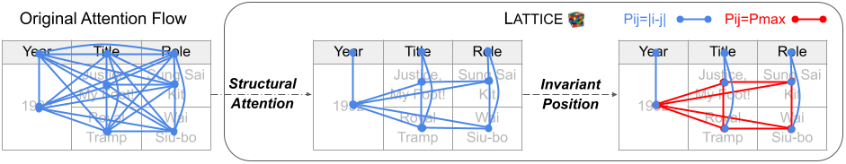

# Lattice
Code for our paper [Robust (Controlled) Table-to-Text Generation with Structure-Aware Equivariance Learning](https://arxiv.org/abs/2205.03972) at NAACL 2022.
If you find the code useful, please cite the following paper.
```
@inproceedings{wang2022robust,
  title={Robust (Controlled) Table-to-Text Generation with Structure-Aware Equivariance Learning},
  author={Wang, Fei and Xu, Zhewei and Szekely, Pedro and Chen, Muhao},
  booktitle={Proceedings of the 2022 Conference of the North American Chapter of the Association for Computational Linguistics: Human Language Technologies},
  year={2022}
}
```

## Quick Links
  - [Overview](#overview)
  - [Requirements](#requirements)
  - [Train](#train)
  - [Robustness Evaluation](#robustness-evaluation)


## Overview
Previous table-to-text generation methods suffer from the loss of structural information and are brittle to table layout change. Lattice alters Transformer with a [structure-aware self-attention mechanism](model/structural_attention.py), and a [tranformation-invariant positional encoding mechanism](model/invariant_position.py) to address the aforementioned problems.




## Requirements
```bash
pip install -r requirements.txt
```

## Train
You can train your own model following these steps.

1. Download [ToTTo dataset](https://github.com/google-research-datasets/totto)
```bash
 wget https://storage.googleapis.com/totto-public/totto_data.zip
 unzip totto_data.zip
```

2. Preprocess data
```bash
python preprocess/preprocess_data.py --input_path="totto_data/totto_dev_data.jsonl" --output_path="totto_data/dev_linearized.jsonl"
python preprocess/json_to_csv.py -i totto_data/dev_linearized.jsonl -o totto_data/dev.csv

python preprocess/preprocess_data.py --input_path="totto_data/totto_train_data.jsonl" --output_path="totto_data/train_linearized.jsonl"
python preprocess/json_to_csv.py -i totto_data/train_linearized.jsonl -o totto_data/train.csv
```

3. Train model
```bash
bash run.sh
```

After running the script, you will get trained model weights, training logs, and results in the output folder, including the predicted summaries in `generated_predictions.txt`.

Note that the evaluation process for each checkpoint during training are simplified for efficiency, so the BLEU scores are lower than the final evaluation results. You can change the setting according to [this post](https://discuss.huggingface.co/t/evaluation-results-metric-during-training-is-different-from-the-evaluation-results-at-the-end/15401). To get accurate scores, please use the official [evaluation tool](https://github.com/google-research/language/tree/master/language/totto). You can also submit your predictions to the [official leaderboard](https://github.com/google-research-datasets/totto#leaderboard) through [this form](https://forms.gle/AcF9TRqWrPhPzztt7).

## Robustness Evaluation
To get the hard version of ToTTo introduced in section 3.3 of our paper, a simple way is to perturb the row/column indices of `highlighted_cell` at the end of the [get_highlighted_subtable](https://github.com/luka-group/Lattice/blob/3cb2dab5769052e189a16f98022278cc4e9e12f8/preprocess/preprocess_utils.py#L64) function. We apply the following three content-neutral table transformations:
* row shuffling -- map row indices to a different permutation;
* column shuffling -- map column indices to a different permutation;
* table transposing -- swap row and column indices.


